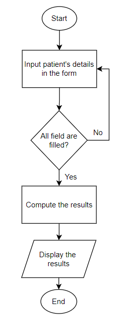
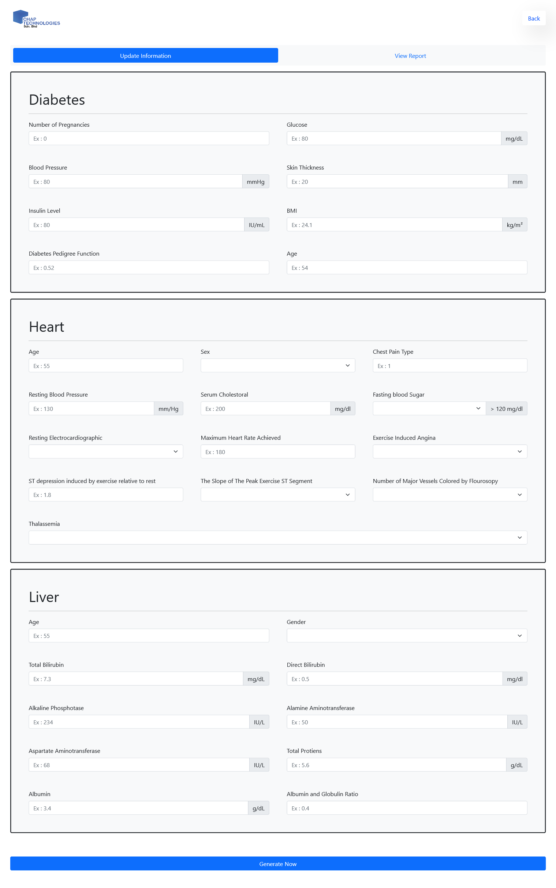
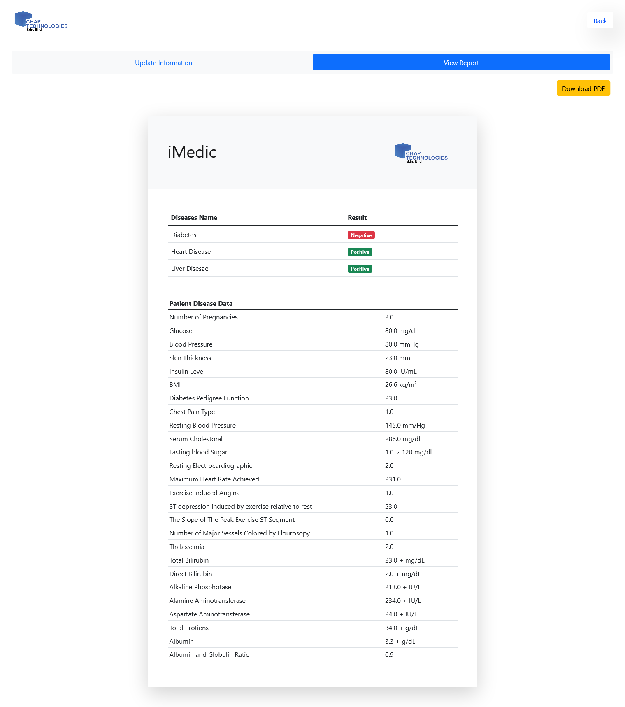

# 👓 PROJECT OVERVIEW

## D. EXECUTING THE PROJECT

### Flowchart



### Code

#### Training

For the training, the datasets used are the `diabetes.csv`, `heart.csv`, and `indian_liver_patient.csv`, which can be viewed in the [Dataset](../Dataset) folder. The training code, which are written in Jupyter Notebook, are located in the [Train](../Train) folder. The model `.pkl` file are located in [Model](../Model) folder.

Here is the code snippet for the training part.

**1. Diabetes model training**
- Training data: [`diabetes.csv`](https://github.com/rootReb0rn/iMedic/blob/main/Dataset/diabetes.csv)
- Algorithm: Linear Discriminant Analysis
- Accuracy: 90%

```Python

import pandas as od
import matplotlib.pyplot as plt
import numpy as np
%matplotlib inline

dataset_path = '../Dataset/diabetes.csv'
data = pd.read_csv(dataset_path)
data.head()

X = data.drop('Dataset',axis=1)
Y = data['Dataset']

print("Total number of sample :",data.shape[0],"\nNO. of features in each sample :", data.shape[1])

duplicates = data[data.duplicated(keep=False)]

print("No. of duplicate Values :", duplicates.shape[0],"\nSize of data",data.shape)

data = data[~data.duplicated(subset=None, keep='first')]
duplicates =data[data.duplicated(keep=False)]

print("No. of duplicate values: e\nsize of data: ",data.shape)

data.isnull().sum()
data = data.dropna()
data.isnull().sum()

from sklearn.preprocessing import LabelEncoder

le = LabelEncoder()
#dataset =1 , dataset = 2
data['Dataset'] = le.fit_transform(~data['Dataset'])
data['Dataset'].unique()

x = data.drop('Dataset', axis =1)
y = data['Dataset']

        ####################End of snippet########################

```

**2. Heart Disease Model Training**
- Training data: [`heart.csv`](https://github.com/rootReb0rn/iMedic/blob/main/Dataset/heart.csv)
- Algorithm: Random Forest Classifier
- Accuracy: 81.32 %

```Python
import numpy as np
import pandas as pd
import matplotlib.pyplot as plt

# Read the heart.csv

df = pd.read_csv('../Dataset/heart.csv')

df.head() # Show head

# Show info of dataset

df.info()

# Check if have missing value

df.isnull().sum()

# Show statistical info of dataset

df.describe()

# Correlation matrix of dataset

import seaborn as sns

corr = df.corr() # get the correlation matrix 

# Plot the correlation matrix
plt.figure(figsize=(25, 25))
sns.heatmap(corr, annot=True, cmap=sns.color_palette("Blues", 12)) # Use blue color

# Assign X as the attributes
X = df.drop(['target'], axis=1)

# Assign y as the label (target column)
y = df['target']

X.head() # show the attributes

# Show the label column
y.head()

from sklearn.model_selection import train_test_split

# Split 70:30 
X_train, X_test, y_train, y_test = train_test_split(X, y, test_size=0.3, random_state=42)

# TEST: Use random forest

from sklearn.ensemble import RandomForestClassifier
model = RandomForestClassifier(n_estimators=100)
model.fit(X_train, y_train)

pred = model.predict(X_test)

        ####################End of snippet########################
```

**3. Liver Model Training**
- Training data: [`indian_liver_patient.csv`](https://github.com/rootReb0rn/iMedic/blob/main/Dataset/indian_liver_patient.csv)
- Algorithm: Random Forest Classifier
- Accuracy: 76.27%

```Python
import numpy as np
import pandas as pd
import matplotlib.pyplot as plt
%matplotlib inline

dataset_path = '../Dataset/indian_liver_patient.csv'
data = pd.read_csv(dataset_path)
data.head()

data.info()
data.describe()

data.isnull().sum()

data['Albumin_and_Globulin_Ratio'] = data['Albumin_and_Globulin_Ratio'].fillna(0.947064)

data.isnull().sum()

import seaborn as sns
sns.countplot('Dataset', data = data)

data['Dataset'] = data['Dataset'].replace([2,1],[1,0])
data['Dataset'].head()

import seaborn as sns
sns.countplot('Dataset', data = data)

sns.countplot('Gender', data = data, hue = 'Dataset')

data = pd.get_dummies(data, columns = ['Gender'], drop_first = True)
data.head()

plt.figure(figsize = (20,20))
sns.heatmap(data.corr(), annot = True)

sns.pairplot(data, hue = 'Dataset')
data.corr()

X = data.drop('Dataset', axis = 1)
y = data['Dataset']

from sklearn.model_selection import train_test_split
X_train, X_test, y_train, y_test = train_test_split(X, y, test_size = 0.1, random_state = 42)

print("Train Set: ", X_train.shape, y_train.shape)
print("Test Set: ", X_test.shape, y_test.shape)

from sklearn.ensemble import RandomForestClassifier
model = RandomForestClassifier(n_estimators=20)
model.fit(X_train, y_train)

        ####################End of snippet########################
```

#### Web application

**1. Dependencies**

For the web application, Flask is used to as the web framework. The dependencies are:

- `flask`
- `numpy`

To install the dependencies, run `pip install flask numpy`

**2. Code Snippet**

The code snippet of the code for creating the web server:

```Python
from flask import Flask, app, render_template, request, flash, redirect
import pickle
from flask.sessions import NullSession
import numpy as np

app = Flask(__name__)


@app.route('/')
def main_page():
    return render_template('index.html')


@app.route('/prediction')
def prediction():
    return render_template('prediction.html', report=0)


@app.route("/predict", methods=['POST', 'GET'])
def predictPage():
    if request.method == "POST":

        diabetes_list = []
        heart_list = []
        liver_list = []

        ####################End of snippet########################
```

The full code can be viewed in [app.py](../Src/app.py) file in the [Src](../Src) folder.

## Project Result

### Homepage
Homepage and the About Us section of the web app


### Form
For entering patient's details as input data for the model



### Result Page
Displaying the result of the model - i.e., negative or positive. The [Project Result.pdf](Assets/Execution/Project%20Result.pdf) shows the result output from the website.




---
◀ Back : [Project Implementation](C-PROJECT_IMPLEMENTATION.md)

Next : [Project Closing ▶](E-PROJECT_CLOSING.md)
