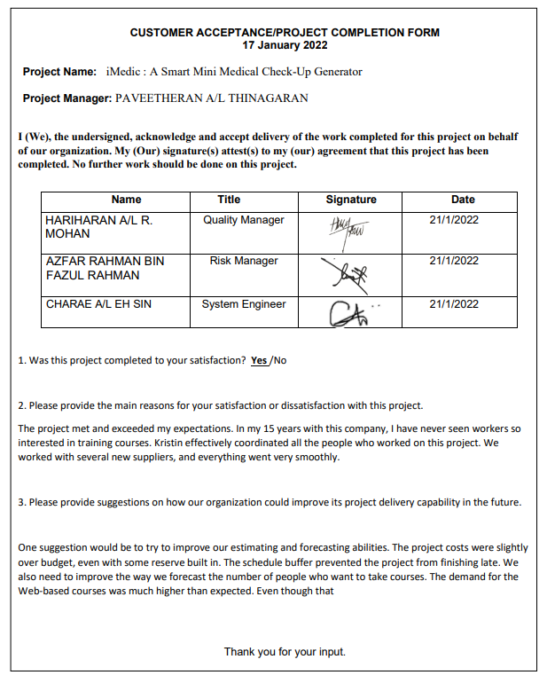
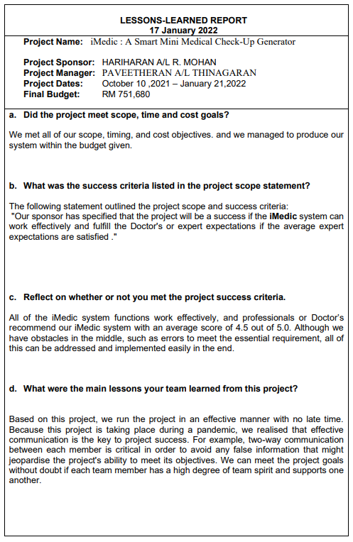
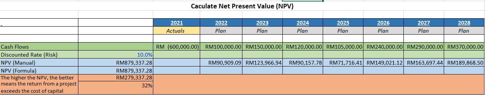
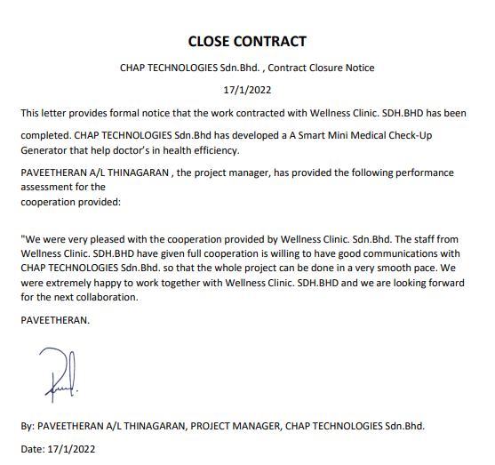

# 👓 PROJECT OVERVIEW 
## E. COMPLETING THE PROJECT

## Customer Acceptance Form

## Lessons-Learned Form

## Final Project Report
4.0 Original and Actual Budget

4.1 Cost Estimation:

4.2 NPV value:
  
  
  
4.2 Cost Breakdown:

   
   
  
5.0 PROJECT ASSESSMENT

5.1 SCOPE

The project scope was initiated from the beginning of the project. For instance, the system is able to help doctor's to make a faster process in examining patient.

5.2 OBJECTIVES

CHAP TECHNOLOGIES Sdn.Bhd was able to meet the goals set out at the start of the project. A Machine Learning system driven by artificial intelligence has been created. Machine Learning is used in this research to determine the patient health as well as help the doctor's . Furthermore, flask framework is utilised to integrate the python application used to provide health presciption into an website in short period time. Our goal of creating an health website in the system was to enhance the effeciency to treat patient.

5.3 IMPACTS

This can help to have mini medical check-up and by having this we can prevent any serious illness to he patient and make appropriate treatment. this will also prevent or reduce cost in medical and being  sufficient to the patient.

6.0 TRANSITION PLAN

CHAP TECHNOLOGIES Sdn.Bhd staff will provide support when require. The main work of support provided by CHAP TECHNOLOGIES Sdn.Bhd staff on the :   iMedic : A Smart Mini Medical Check-Up Generator project are as shown below:

i) Maintain the system

ii) Handling errors and updates of the system

iii) Provide user guidelines for doctor's and staff to use the system

iv) Report information to senior management on monthly basis.

## Close Contract

---
◀ Back : [Project Execution](D-PROJECT_EXECUTION.md)  

Next : [Main Page ▶](../README.md)
